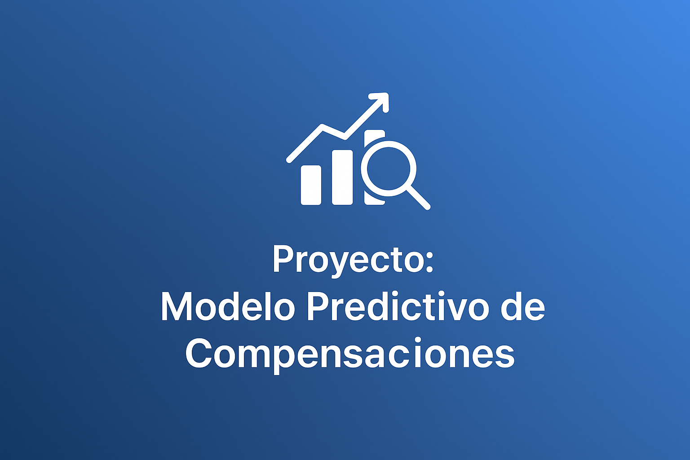

# 🧠 Proyecto: Modelo Predictivo de Compensaciones

  

Este repositorio contiene un modelo de **machine learning** diseñado para predecir compensaciones/reclamaciones de clientes a partir de datos históricos.  

---

## 📌 Contenido
- Notebooks -> contiene jupyter notebooks con extraccion de datos, EDA, preprocesamiento, modelado y otros
- src -> archivos con funciones y clases utilizadas en el preprocesamiento y construccion de pipeline
- pipeline -> contiene el codigo pickle del pipeline con el preprocesamiento y modelado
- models -> contiene los mejores modelos obtenido y el modelo final en formato pickle
- docs -> contiene la memoria general y técnica, y las presentaciones a negocio y equipo técnico
- data -> contiene el conjunto de datos original (quejas-clientes.csv) y otros conjuntos de datos.
- app -> contiene los archivos para desplegar el modelo predictivo final con gradio en un space de HuggingFace
- Images -> contiene diferentes imágenes utilizadas en las presentaciones de docs

---
